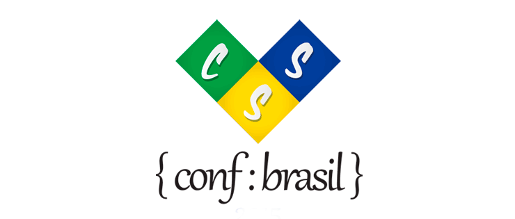

[Visit the website](http://www.cssconfbrasil.com.br)

## Contributing

Please read this [Coding Style](https://github.com/LFeh/coding-style/) for [Issues](https://github.com/cssconfbrasil/website/issues), pull requests and coding standards.

All changes must be made in `/assets` folder. The CSS should be modified using the **SASS** preprocessor.

For facilitate the contribution of any people in projects, all commit messages, pull request title or issues discussion must be in **English**.

Before commit adjusts in project, check if exists an open issue and make references for this issue using '#' in your commit message.

### Getting Started

Some steps:

Install all dependencies

`npm install`

`Watch` task and enjoy

`grunt live`

## License

MIT License © [CSS Conf Brasil](https://github.com/cssconfbrasil)